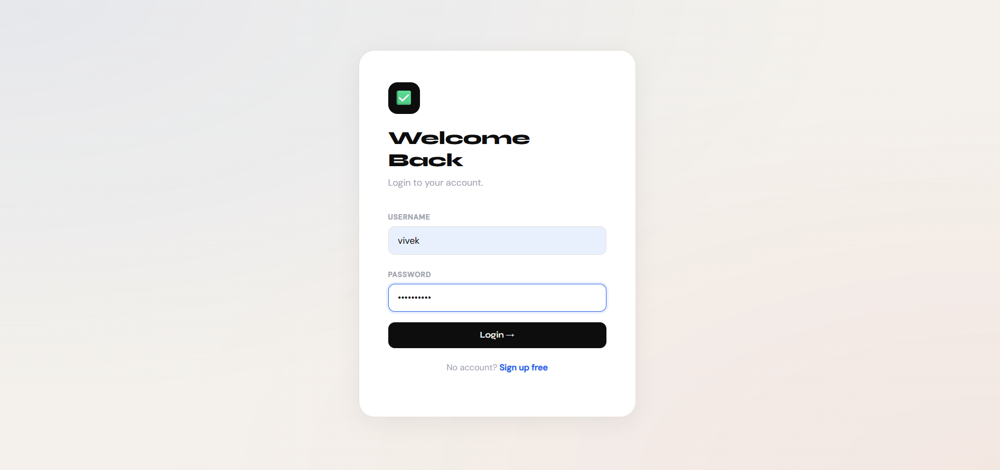

# Taskly — Advanced Todo Application

A multi-user Flask web application for managing tasks with priority levels, due dates, status tracking, and search/filter functionality.




---

## What it does

- **Multi-user system** — each user sees only their own todos
- **Login / Signup** — session-based authentication with flash messages
- **Priority levels** — High, Medium, Low with color indicators
- **Due dates** — set and track deadlines for each task
- **Status toggle** — switch between Pending and Complete in one click
- **Search & Filter** — case-insensitive search across title and description
- **Filter by priority** — view only High/Medium/Low tasks

---

## Tech Stack

| Layer | Technology |
|---|---|
| Backend | Python, Flask |
| Database | SQLite + SQLAlchemy |
| Frontend | HTML, CSS, Bootstrap |
| Authentication | Flask Session + Secret Key |
| Environment | python-dotenv |

---

## Project Structure

```
Taskly/
├── app.py          # Main Flask app — all routes and logic
├── models.py       # Database models — User and Todo
├── templates/
│   ├── base.html   # Base template — navbar, CSS
│   ├── index.html  # Homepage — add and view todos
│   ├── login.html  # Login page
│   ├── signup.html # Signup page
│   └── update.html # Update todo page
├── .env            # Secret key — never commit
├── requirements.txt
└── README.md
```

---

## Run Locally

**1. Clone the repo**
```bash
git clone https://github.com/viveknayee/Taskly
cd Taskly
```

**2. Create virtual environment**
```bash
python -m venv venv
venv\Scripts\activate
```

**3. Install dependencies**
```bash
pip install -r requirements.txt
```

**4. Create `.env` file**
```
SECRET_KEY=your_secret_key_here
```

**5. Run the app**
```bash
python app.py
```

**6. Open browser**
```
http://127.0.0.1:5000
```

---

## Key Concepts Used

- `db.init_app(app)` — separate models file pattern for clean code
- `session` — stores user login state across requests
- `flash()` — one-time messages after redirect
- `ilike()` with `or_()` — case-insensitive multi-field search
- Foreign key `user_id` — links todos to users safely
- Ternary operator for status toggle — one line handles both directions

---

*Built by [Vivek Nayee](https://github.com/viveknayee)*
